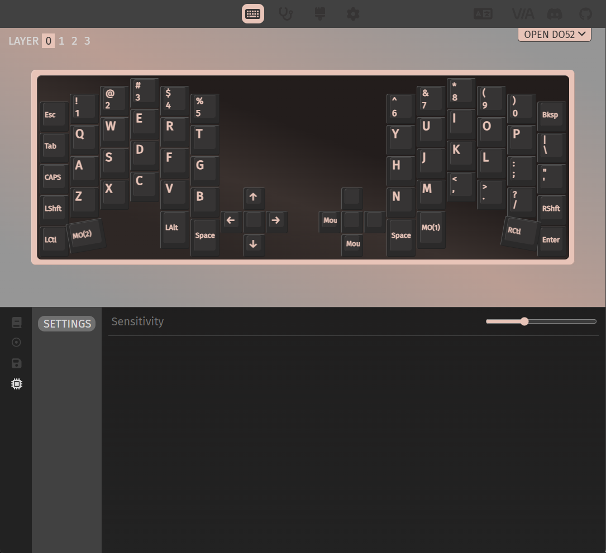
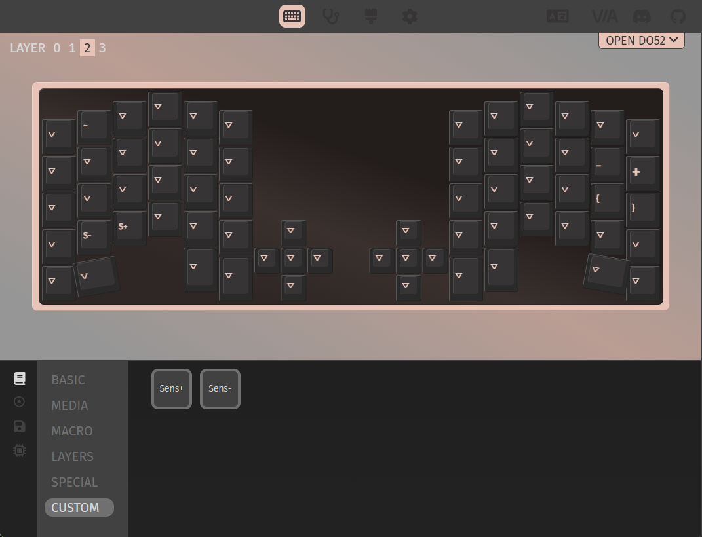

# Open DO52

Open-source QMK firmware for the YK DO52 split keyboard with ThinkPad TrackPoint.

## Features

- **QMK + VIA** — full keymap customization with live remapping via [VIA](https://www.caniusevia.com/)
- **EE_HANDS** — plug USB into either half, the keyboard auto-detects left/right
- **ThinkPad TrackPoint** — integrated pointing device on the right half (PS/2 interrupt driver)
- **Adjustable sensitivity** — VIA slider or dedicated Sens+/Sens- keycodes, saved to EEPROM
- **DPAD modes** — 5-way nav switch (default), single key, or rotary encoder
- **Split keyboard** — halves communicate via serial over TRRS cable
- **CI/CD** — GitHub Actions builds firmware and creates releases with left/right hex files

## Current Status

| Feature | USB on Right | USB on Left |
|---------|:---:|:---:|
| Keys (all layers) | Working | Working |
| TrackPoint cursor | Working | Not yet working |
| TrackPoint buttons | Working | Not yet working |
| VIA remapping | Working | Working |
| Sensitivity adjustment | Working | Working |

> **Note:** TrackPoint currently only works when USB is connected to the right half.
> The PS/2 remote-mode driver requires interrupts that are unavailable on the slave
> side during split serial transactions. A stream-mode driver to fix this is in progress.

## VIA Support

Load the draft definition from `via/open_do52.json` in VIA's Design tab.

### Sensitivity Slider

The TrackPoint settings menu provides a sensitivity slider (1-255). Changes are saved to EEPROM automatically.



### Custom Keycodes

Layer 2 includes Sens+ and Sens- keys for on-the-fly sensitivity adjustment. These custom keycodes can be mapped to any key in VIA.



## Keymap Layers

| Layer | Activation | Description |
|-------|-----------|-------------|
| 0 | Default | QWERTY base, arrows, mouse buttons, MO(1)/MO(2) on thumbs |
| 1 | MO(1) right thumb | Navigation (Home/End/PgUp/PgDn) + symbols (- = [ ] `) |
| 2 | MO(2) left thumb | Shifted symbols (_ + { } ~) + Sens+/Sens- |
| 3 | — | Reserved (transparent) |

Encoders: left = volume up/down, right = mouse scroll up/down.

## Quick Start

1. Download the latest [release](../../releases) — grab both `*_left.hex` and `*_right.hex`
2. Open [QMK Toolbox](https://github.com/qmk/qmk_toolbox), select the correct hex for each side
3. Put each Pro Micro into bootloader mode (short RESET to GND) and flash

Or build from source — see the [Build Guide](docs/build-guide.md).

## Building from Source

```bash
# Install QMK
pip3 install qmk
qmk setup

# Link keyboard into QMK tree
ln -s $(pwd)/keyboards/open_do52 ~/qmk_firmware/keyboards/open_do52

# Compile
qmk compile -kb open_do52 -km via

# Flash each half (first time — sets left/right identity in EEPROM)
qmk flash -kb open_do52 -km via -bl avrdude-split-left   # left half
qmk flash -kb open_do52 -km via -bl avrdude-split-right  # right half
```

## DPAD Modes

```bash
qmk compile -kb open_do52 -km via                    # mode 0: 5-way nav (default)
qmk compile -kb open_do52 -km via -e DPAD_MODE=1     # mode 1: single key
qmk compile -kb open_do52 -km via -e DPAD_MODE=2     # mode 2: rotary encoder
```

## Pin Map

| Pin | Function |
|-----|----------|
| D3, D2, D1, D4, C6, D7 | Matrix columns 0-5 |
| B4, B5, F4, E6, F5, F6 | Matrix rows 0-5 |
| D0 | Split serial (TRRS) |
| B1 | PS/2 TrackPoint clock |
| B2 | PS/2 TrackPoint data |

## Credits

Pin mapping reverse-engineered from YK manufacturer firmware. Reference repos:
- [Canorus/do42-do52](https://github.com/Canorus/do42-do52) — DO42 QMK source
- [ilfmoussa/do52pro](https://github.com/ilfmoussa/do52pro) — DO52 RP2040 port
- [RebezovAndrei/do52-keyboard](https://github.com/RebezovAndrei/do52-keyboard) — Original firmware + VIA JSON

## License

GPL-2.0 (matches QMK)
